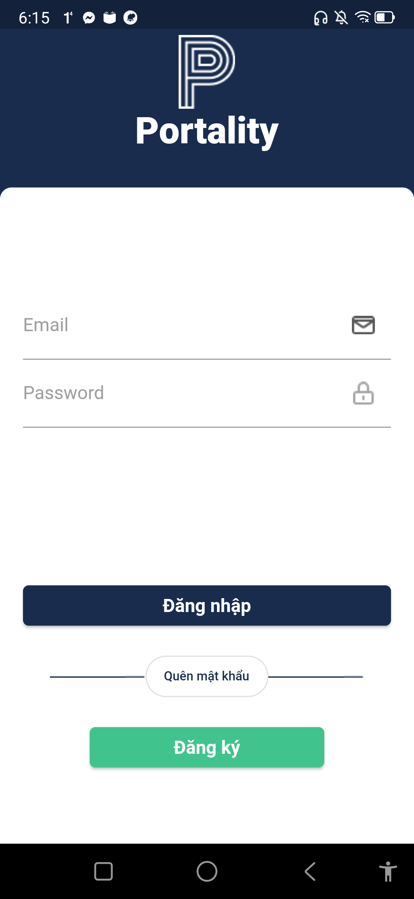
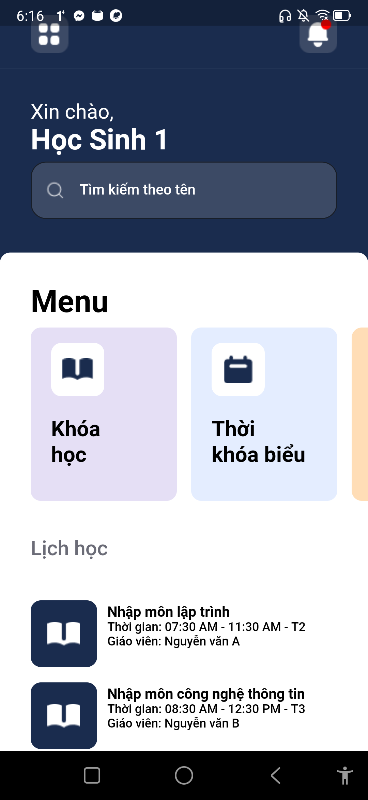
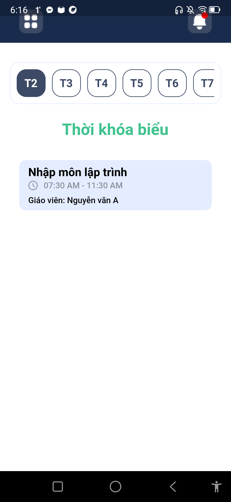
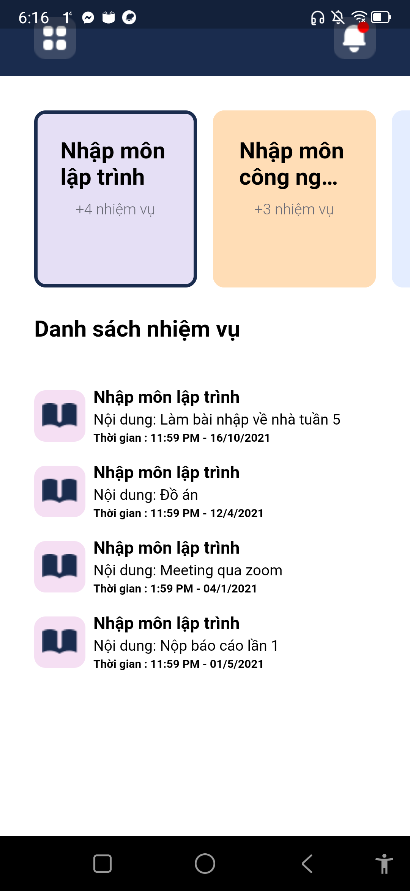
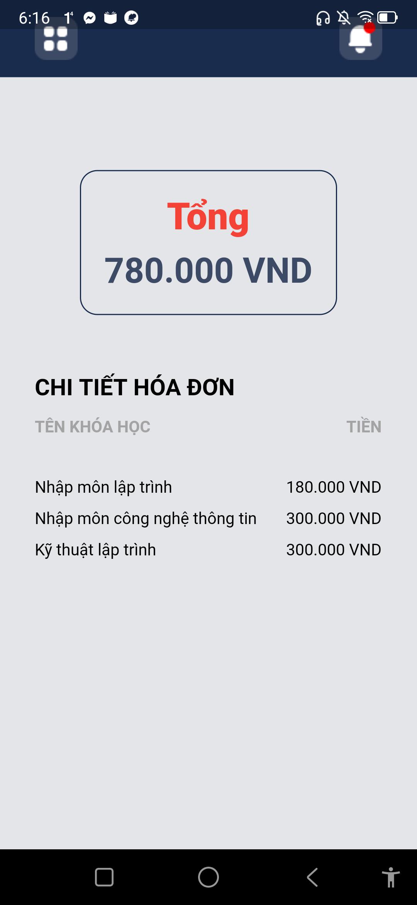
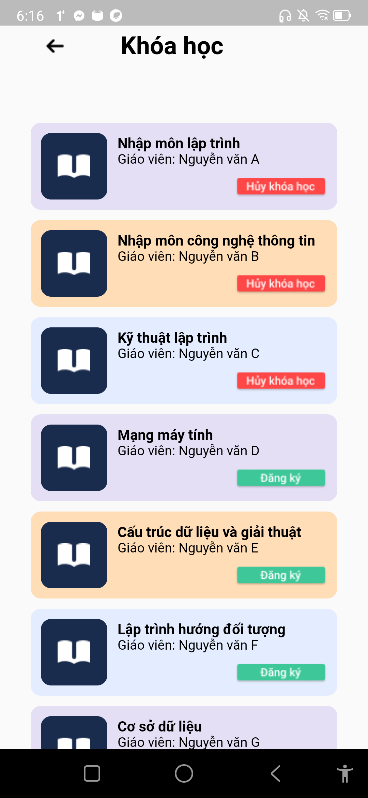
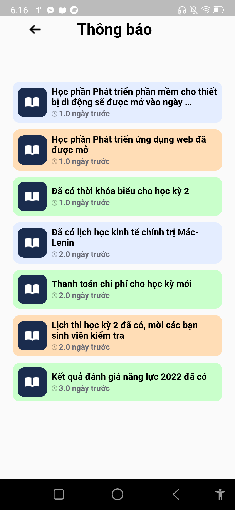

# App Portality

Ứng dụng quản lí học sinh

1. Sử dụng Provider để quản lí state
2. Vì dữ liệu được cài đặt cứng, nên sử dụng shared preferences để lưu trữ khóa học.
3. Màn hình tối thiểu để sử dụng: height - 541, Width - 325
4. Link apk: https://drive.google.com/drive/folders/12564fEwbWCd8nmec1eq3MRBc_NzB7j8H?usp=sharing
5. Chức năng Đăng ký không khả dụng, tài khoản dùng để đăng nhập: hocsinh1@gmail.com  MK: 123123

Các màn hình có trong ứng dụng

